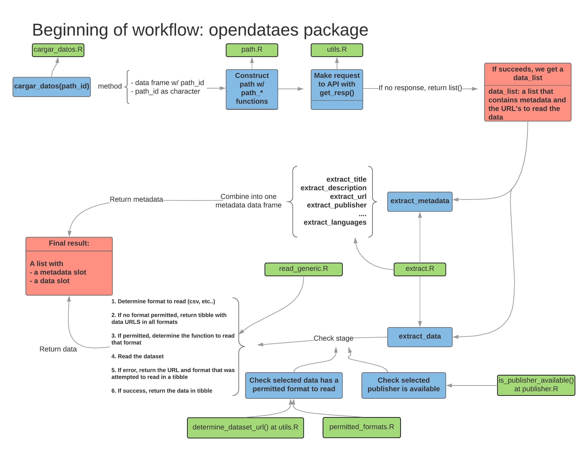
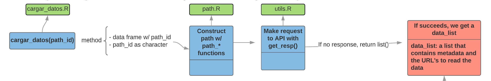
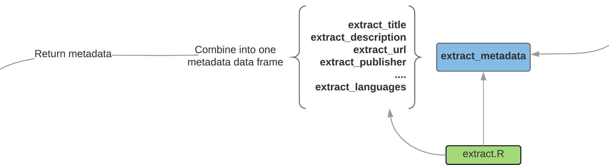
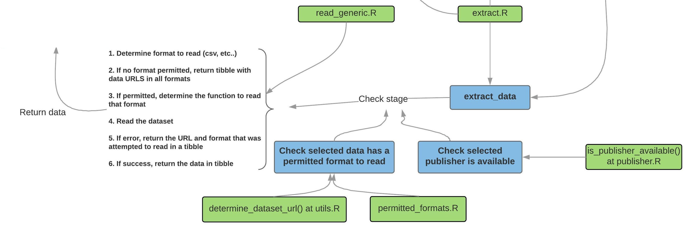

```{r setup, include = FALSE}
knitr::opts_chunk$set(
  collapse = TRUE,
  comment = "#>",
  fig.align="center"
)
```

`opendataes` is package that was ultimately though of to be maintained by the R community. The package is extremely useful in automating some tasks but also limited in some aspects. This vignette is aimed at describing in detail how the package works so that new users can understand the inner workings of `opendataes` and contribute more easily.

## How does this work anyway?



<br>

Woah, that's a lot of information. We'll go step by step and tear it apart. First, let's look at the legend of each box

<br>


I'll explain it further just to make it clearer. The red boxes are information boxes. That is, they don't document a function call in the process, so just take it as an explanation of the process. The blue boxes are the most important because they document the function calls. That is, each of the blue boxes represent a function being called that represents an important step in the process of reading the data. Finally, the green boxes represent where the function in the blue box is at in the package structure. This is handy when you want to read through the source code of the function without much hassle.

That said, let's explore the first step in the process. 

## Preparing and calling the API



First step we begin with `cargar_datos` which is the main function. It accepts the typical `path_id` of the dataset as string. For example:

```{r}
library(opendataes)
path_id <- 'l01080193-elecciones-al-parlamento-europeo-sobre-electores'
```

```{r, eval = FALSE}
library(opendataes)

path_id <- 'l01080193-elecciones-al-parlamento-europeo-sobre-electores'
cargar_datos(path_id)
```

However, it also has a method for a data frame. This method is aimed at data frames returned by `explorar_keywords` so it is very strict about what it accepts.

```{r}
cargar_datos
```

The function redirects to `check_keywords_df`, an internal function, that checks whether the data frame has the `path_id` column, among other checks. Finally, it assigns the data frame a class `datos_gob_es_keywords` and passes it to the method. The method for this class is merely calling the `path_id` column to get the string to read as we can see:

```{r}
opendataes:::cargar_datos.datos_gob_es_keywords
```

So we end up with the same call as if we would've called the main argument with a string containing the `path_id`. As the diagram suggests, you can find these functions in the R script `R/cargar_datos.R` in the Github repository. Once `cargar_datos` passes the string as the main argument it constructs the whole path for the API using a family of functions found in `R/path.R`. More concretely, it defines the complete path using `path_dataset_id(path_id)` which returns the direct path of the API to query the data set. If interested in looking at how this and the other path functions work, they are all located and documented at `R/path.R` in the Github repo.

At the end of this preprocessing step, `cargar_datos` passes this complete path to `get_resp` which simply sends a GET request to the API. For interacting with the API we're using the `httr` package which is very intuitive. The function `get_resp` returns a list with the response from the API. Interally, we've defined the output of `get_resp` as a `data_list`. You will find this name in several places in the package. The `data_list` is just a list that contains the metadata of the dataset and the links to the data from the original publisher (so the direct links to the data from the Ayuntamiento de Madrid or Malaga).

```{r}
# Note that these specific function calls might change in the future,
# but for the sake of showing the format of a data_list we run it.
data_list <- opendataes:::get_resp(opendataes:::path_dataset_id(path_id))
data_list
```

Before we extract the metadata and data, `cargar_datos` checks that the `data_list` is in the correct format that we would expect, because otherwise none of the functions we will use would work. If the `data_list` is not in the correct format this returns an empty list.

`opendataes` really pushes for consistent outputs. That is, it usually returns a list with two slots containing the metadata and data and if the data poses some sort of problem, we should return the same list with two slots but without the data itself. However, if the `data_list` is not in the correct format it means that the API is returning something odd in the first place. This is regardless of the quality or format of the dataset. In this scenario we prefer to return an empty list but this is open to debate. This is an area where new pull requests would be needed.

As you can see, the `data_list` is long, messy and not very intuitive. This is when we move to the second step of the diagram.

## Extracting the metadata



This is actually the easiest part of all. The metadata is scattered around the `data_list` but it keeps consistent names so we built all the `extract_*` functions that are present in the diagram. We combine all of these helper functions into `extract_metadata` to provide a general `tibble` of metadata. But all of the high level results of the `data_list` are actually details of the request and `datos.gob.es`. In the example below, we dig deeper where the data is.

For example..

```{r}
# This is the slot where the data is. This is the case
# even when there are several datasets to read.
# It is safe only to search HERE for the data
# and metadata
data_list <- data_list$result$items[[1]]

opendataes:::extract_metadata(data_list)
```

Inside this function we're just calling separate `extract_*` functions to grab each piece of metadata. For example..

```{r, eval = FALSE}
keywords <- extract_keywords(data_list)
description <- extract_description(data_list)
languages <- extract_language(data_list)
url_path <- extract_url(data_list)
```

Once that's done, the metadata is ready. Each of these functions is located in the `R/extract.R` path. Now we move on to the trickiest step: extracting the data.

## Extracting the data



The first step is passing the `data_list` to `extract_data` which can be located at the path `R/extract.R`. The difficult part of reading the data is due to the fact that different publishers keep datasets with different formats. For example, the Ayuntamiento of Madrid might have a csv file with only one excel sheet in a very organized tabular format but the Ayuntamiento de Arganda del Rey might have several sheets with several tables inside each sheet. There's really nothing that can be done about that if the aim of the package is to scale data reading across several cities, provincies and autonomous communities. The chosen solution, we believe, is the most conservative: limit the publishers and formats that we can read.

The first step that `cargar_datos` takes before calling the `extract_*` functions is to check whether the data comes from our permitted publishers. If the datasets is not from an available publisher, it raises an error. The criteria we think it's best to include new publishers is to check by brute force whether they have patterns of standardization. For example, the first publisher we accepted as reliable was 'Ayuntamiento of Barcelona' because we repeatedly found ourselves reading datasets from the same format which were very consistent and easier to read. For the list of available publishers that `opendataes` can read, see `opendataes::publishers_available`. This is one of the main areas were we need support. We are always welcoming pull requests that would allow us to read new publishers as long as we can have some sort of proof of consistency in their datasets.

The second problem, and very related to the previous, is the formats that we can read. Because standardization across formats is one of our main concerns, we are interested in reading formats which are very consistent and are predictable for reading. Fortunately for our selves, around 70% of all datasets in `datos.gob.es` are `csv` files, a very standard format. For that reason, it is the first format that we give preference for reading. You can check the permitted formats with `opendataes::permitted_formats`. This is one are where we are actively looking for new pull requests as we are interested in broadening our scope of formats as much as possible.

From the package's perspective there are two things that can be done to further increase the number of publishers and formats: push each of our publishers for greater standardization and check whether we can read a reasonable number of file formats from a given publisher. 

Having said that, the first thing that `extract_data` does is to check whether the selected dataset has any of the formats that `opendataes` can read. If it doesn't, then it doesn't attempt to read anything but merely returns the dataset's URL's in all the formats available. For example..

```{r}
# $`unavailable_formats`
# A tibble: 13 x 3
#   name                       format URL                                                                           
#   <chr>                      <chr>  <chr>                                                                         
# 1 2018_3T_CARRIL_BICI_CONST~ zip    http://opendata-ajuntament.barcelona.cat/resources/bcn/2018_3T_CARRIL_BICI_CO~
# 2 CARRIL_BICI_CONSTRUCCIO.s~ NA     http://opendata-ajuntament.barcelona.cat/resources/bcn/CARRIL_BICI_CONSTRUCCI~
# 3 CARRIL_BICI_CONSTRUCCIO.p~ asc    http://opendata-ajuntament.barcelona.cat/resources/bcn/CARRIL_BICI_CONSTRUCCI~
# 4 2018_2T_CARRIL_BICI_CONST~ zip    http://opendata-ajuntament.barcelona.cat/resources/bcn/2018_2T_CARRIL_BICI_CO~
# 5 CARRIL_BICI_CONSTRUCCIO.g~ json   http://opendata-ajuntament.barcelona.cat/resources/bcn/CARRIL_BICI_CONSTRUCCI~
# 6 CARRIL_BICI_CONSTRUCCIO.z~ zip    http://opendata-ajuntament.barcelona.cat/resources/bcn/CARRIL_BICI_CONSTRUCCI~
# 7 2017_4T_CARRIL_BICI_CONS.~ zip    http://opendata-ajuntament.barcelona.cat/data/dataset/edee68e3-5ff1-43d0-b556~
# 8 2018_1T_CARRIL_BICI_CONS.~ zip    http://opendata-ajuntament.barcelona.cat/data/dataset/edee68e3-5ff1-43d0-b556~
# 9 2017_3T_CARRIL_BICI_CONS.~ zip    http://opendata-ajuntament.barcelona.cat/data/dataset/edee68e3-5ff1-43d0-b556~
# 10 CARRIL_BICI_CONSTRUCCIO.d~ asc    http://opendata-ajuntament.barcelona.cat/resources/bcn/CARRIL_BICI_CONSTRUCCI~
# 11 CARRIL_BICI_CONSTRUCCIO.s~ NA     http://opendata-ajuntament.barcelona.cat/resources/bcn/CARRIL_BICI_CONSTRUCCI~
# 12 2017_2T_CARRIL_BICI_CONS.~ zip    http://opendata-ajuntament.barcelona.cat/data/dataset/edee68e3-5ff1-43d0-b556~
# 13 2017_1T_CARRIL_BICI_CONS.~ zip    http://opendata-ajuntament.barcelona.cat/data/dataset/edee68e3-5ff1-43d0-b556~
```

where the user would get each file name with their format and direct URL in case they want to read it manually. In case the dataset has at least **one** of the permitted formats, then the process is different.


